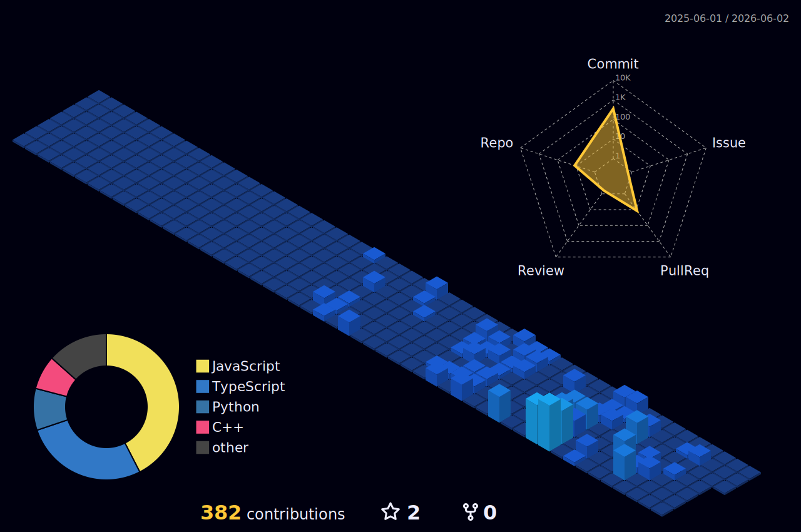

<h1 align="center">Hello, I'm Richter Anthony 👋</h1>
<h3 align="center">BS Computer Science | DOST Scholar | Full-Stack Developer</h3>

  
  
  

---

</td>
<td width="40%" valign="center" align="center">
    
  
<b>My GitHub Activity</b>

  
</td>

  

---

### 🛠️ Languages & Tools

  

---
⭐️ *Feel free to explore my repositories below to see what I'm working on!*
